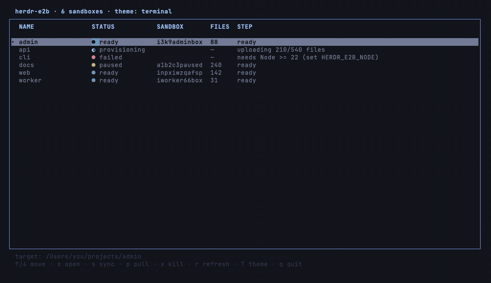

# herdr-e2b

Send a [herdr](https://herdr.dev) git worktree to a fresh [E2B](https://e2b.dev)
cloud sandbox **on demand** — a **snapshot upload of the live tree, uncommitted
changes and all** (no push, no clone, no creds). Press `prefix+shift+e` in a
worktree to boot its sandbox and drop into a shell; the sandbox is torn down when you
remove the worktree.


…or drive it all from a **dashboard** (`prefix+shift+d`) — a live board of your
sandboxes; open one, work in its shell, and land right back on the board:



## The loop

Creating a worktree does **nothing** by itself — you decide which worktrees go
to the cloud. When you want one up:

```
prefix+shift+e  (or: e2b-box open) ──▶ e2b-box provisions on the spot
                                   │  marks the sandbox "provisioning"
                                   ▼
                             node provision.js (detached)
                               create E2B sandbox  ·  metadata: herdrWorktreeKey=<folder>
                               upload the worktree (batched sandbox.files.write)
                               git init  ·  record sandbox id + preview URL
                                   │
              spinner while booting ▼
                             `e2b sandbox connect <id>`   ← shell in the sandbox
                                   │  (type `exit` in the sandbox)
                                   ▼
                             on close: [p]ull changes down · [k]ill · [L]eave running

herdr worktree remove ──▶ worktree.removed event ──▶ teardown-worktree ──▶ e2b sandbox kill
```

Each worktree/folder gets its own sandbox, keyed by the folder's path. Nothing is
auto-merged or pushed; the sandbox is scratch cloud compute that starts as an exact
copy of your worktree.

## Requirements

- **herdr ≥ 0.7.0**, **Node.js ≥ 22** (older Node trips the `e2b` SDK's ESM
  imports; the plugin auto-resolves a newer Node if herdr runs on an older one),
  **jq**
- **E2B**: the `@e2b/cli` (`e2b` on PATH, for the sandbox shell) and an API key
  ([dashboard](https://e2b.dev/dashboard)). Provide the key **either** way:
  - `[secrets].e2b_api_key` in the plugin config (herdr-native, out of your
    shell profile and the repo, picked up by the running server — **recommended**), or
  - export **`E2B_API_KEY`** in the env herdr launches from (wins if both set).

## Install

    herdr plugin install tomasvarga/herdr-e2b

Local dev: `herdr plugin link /path/to/herdr-e2b` then `./install.sh`.
Then bind a key to the `plugin.herdr-e2b.open` action — e.g. `prefix+shift+e`.
(Avoid plain `prefix+e`: that's herdr's built-in `edit_scrollback`.)

The build step runs `npm install` (pulls the `e2b` SDK) and links `e2b-box`
onto your PATH. Run interactively (`./install.sh` from a terminal), it also
**prompts for your E2B API key** and saves it to the plugin config (hidden
input, `chmod 600`); it skips this silently during `herdr plugin install`
(no TTY) — set the key later then. It won't overwrite an existing config.

## Use

Create worktrees the way you normally do — nothing happens until you send one
up. In the worktree you want in the cloud:

    e2b-box            # provision (if needed) + open the sandbox shell (spinner while booting)
    e2b-box up         # provision in the background, don't attach
    e2b-box status     # this worktree's sandbox record (status, sandbox id, url)
    e2b-box list       # every tracked sandbox
    e2b-box url        # preview URL (https://<port>-<id>.e2b.app)
    e2b-box logs       # tail provisioning progress
    e2b-box sync       # re-upload the current worktree into its sandbox (local → sandbox)
    e2b-box pull       # download the sandbox's files back into this folder (sandbox → local)
    e2b-box kill       # kill this worktree's sandbox

`e2b-box` (no args) also works in a plain worktree that predates the plugin — it
provisions a sandbox on the spot.

### herdr actions

The common verbs are also registered as herdr **actions** (`open`, `sync`,
`pull`, `status`, `kill`), so you can drive them without typing the CLI name.
They act on the **focused pane's** worktree. Invoke one directly:

    herdr plugin action invoke sync --plugin herdr-e2b

or bind a key (optional) in your herdr config:

    [[keys.command]]
    key = "prefix+shift+e"
    command = "herdr plugin action invoke open --plugin herdr-e2b"

`open` opens the interactive sandbox pane; the one-shot verbs print to the plugin
command log (`herdr plugin log list --plugin herdr-e2b`).

## Dashboard (optional TUI)

A live board of every tracked sandbox — status, sandbox id, files — with per-sandbox
actions and theming (shown above). Run `e2b-dash`, open the **dashboard** pane, or
invoke the `dashboard` action. Status is the **last known** state (it updates live
as the plugin provisions/syncs); `open`/`Enter` reconcile with E2B, and `open`
reprovisions a sandbox that has since idle-timed-out.

- **Keys:** `↑/↓` move · `↵` worktree · `o` open · `s` sync · `p` pull · `x` kill ·
  `r` refresh · `T` theme · `q` quit. `sync`/`pull`/`kill` **confirm first** and
  show the exact target worktree; each action runs against *that sandbox's own*
  worktree.
- **`Enter`** jumps to the sandbox's **local worktree** — focuses its herdr
  workspace if it's already open (no duplicate), else opens it. (`o` attaches the
  cloud shell; `Enter` takes you to where you edit.)
- **`open`** hands the pane to the sandbox shell, and on exit the dashboard offers
  pull / kill / leave.
- **Themes:** defaults to your terminal's palette; `T` cycles
  `terminal · solarized-light · tokyo-night · dracula · nord · gruvbox` (your
  choice is remembered). Set a default with `[dashboard].theme` in the config.
- **No dev tools needed:** `install.sh` uses a **prebuilt binary** (macOS
  universal; Linux x64/arm64, glibc) when one matches your platform, and only
  falls back to a `cargo build` from source otherwise. It's a single ~0.5–1 MB
  binary. (musl/Alpine or older glibc: build from source — `cargo` is
  auto-detected. Rebuild the shipped binaries with `tui/build-prebuilt.sh`.)

## How code gets in

File selection follows **git**: `git ls-files --cached --others --exclude-standard`
— tracked files (**including your uncommitted edits**) plus new untracked files,
**honoring `.gitignore`**. So build output, caches, `node_modules`, coverage, etc.
are *not* uploaded — only what git considers part of the repo. The files are sent
via the E2B SDK's `files.write` in batches; `.git` itself is skipped and the sandbox
runs `git init -b <branch>`. The `[upload].ignore` list is an extra safety filter
on top (keeps `.env` out even if tracked); for non-git folders it's the only
filter. Re-run `e2b-box sync` to push local changes up again.

## Templates

Sandboxes default to **`base`** — E2B's minimal image, always available. Fine for
trying the flow, but tight on disk with no toolchain.

### Recommended: a bigger custom template

For real work, build a custom E2B template once — **more disk + CPU**, with your
toolchain (node/pnpm/etc. or a coding agent) baked in — and point the config at it:

```toml
[sandbox]
template = "my-herdr-sandbox"
```

E2B fixes resources at build time, so a custom template is how you get a roomier
sandbox that boots ready. Build it with `e2b template build` (E2B's
[template docs](https://e2b.dev/docs/sandbox-template)) — or ask your coding
agent to set one up. `install.sh` prints this reminder.

### Public agent templates

E2B also ships public agent templates you can name directly (handy, though they
can be tight on disk):

| Agent | Template | E2B docs |
| --- | --- | --- |
| Claude Code | `claude` | [docs](https://e2b.dev/docs/agents/claude-code) |
| Codex | `codex` | [docs](https://e2b.dev/docs/agents/codex) |
| OpenCode | `opencode` | [docs](https://e2b.dev/docs/agents/opencode) |
| Amp | `amp` | [docs](https://e2b.dev/docs/agents/amp) |
| Grok Build | `grok` | [docs](https://e2b.dev/docs/agents/grok) |

Note the Claude Code template is named **`claude`** (not `claude-code`). Some
agents (e.g. **Devin**) have **no prebuilt template** — you install them into a
`base` sandbox yourself (or bake your own template), so there's nothing to name
here.

Route per branch with rules:

```toml
[[sandbox.template_rules]]        # e.g. e2b/cx/* → Codex
pattern  = "^e2b/cx/"
template = "codex"
```

If a configured template isn't available, provisioning falls back to `base` with
a notification rather than failing.

## Configuration

Copy `config/config.example.toml` to
`~/.config/herdr/plugins/config/herdr-e2b/config.toml`. Everything has sane
defaults; set only what you want to change (template, timeout, project path,
preview port, upload batch size, ignore list).

## Limitations (v0.1)

- **Sync is on-demand, not continuous** — `e2b-box sync` pushes local → sandbox and
  `e2b-box pull` brings sandbox → local (git-aware, honors `.gitignore`). `pull` only
  writes files that differ and **reports each one** (`+ new` / `~ overwrote`),
  leaves unchanged files untouched, never deletes local-only files, and warns
  before clobbering a dirty git tree or a non-git folder. Review with `git diff`.
- **Symlinks are skipped** during upload.
- **One sandbox per worktree/folder**, keyed by the folder's **path** (so
  same-named folders in different locations don't collide); the folder name is the
  display label.
- Removing a worktree **kills** its sandbox (cost control) — this is intentional.
- **Sandboxes idle-time-out** after `[sandbox].timeout_ms` (default 1h, and the cap
  on E2B's free tier). If the sandbox has died, `e2b-box open` detects it and
  **reprovisions** a fresh one rather than failing. Bump `timeout_ms` (paid plan)
  for longer-lived sandboxes, or set `[sandbox].auto_pause = true` (**works on the free tier**) to **pause instead of kill** on timeout — reconnecting resumes
  the sandbox with its state instead of starting fresh. On the free tier (1h cap) this is the
  best way to not lose in-sandbox work when the timeout hits.

## License

MIT.
