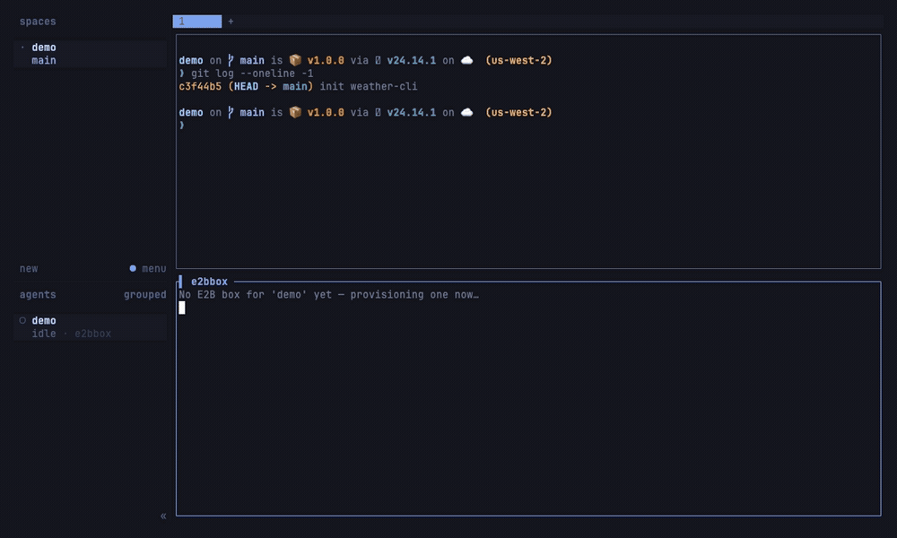

# herdr-e2b

Send a [herdr](https://herdr.dev) git worktree to a fresh [E2B](https://e2b.dev)
cloud sandbox **on demand** — a **snapshot upload of the live tree, uncommitted
changes and all** (no push, no clone, no creds). Press `prefix+shift+e` in a
worktree to boot its box and drop into a shell; the box is torn down when you
remove the worktree.



> Status: early (v0.1). macOS + Linux.

## The loop

Creating a worktree does **nothing** by itself — you decide which worktrees go
to the cloud. When you want one up:

```
prefix+shift+e  (or: e2b-box open) ──▶ e2b-box provisions on the spot
                                   │  marks the box "provisioning"
                                   ▼
                             node provision.mjs (detached)
                               create E2B sandbox  ·  metadata: herdrWorktreeKey=<folder>
                               upload the worktree (batched sandbox.files.write)
                               git init  ·  record sandbox id + preview URL
                                   │
              spinner while booting ▼
                             exec `e2b sandbox connect <id>`   ← shell in the box

herdr worktree remove ──▶ worktree.removed event ──▶ teardown-worktree ──▶ e2b sandbox kill
```

Each worktree/folder gets its own box, keyed by folder name. Nothing is
auto-merged or pushed; the box is scratch cloud compute that starts as an exact
copy of your worktree.

## Requirements

- **herdr ≥ 0.7.0**, **Node.js ≥ 18**, **jq**
- **E2B**: the `@e2b/cli` (`e2b` on PATH, for the box shell) and an API key
  ([dashboard](https://e2b.dev/dashboard)). Provide the key **either** way:
  - `[secrets].e2b_api_key` in the plugin config (herdr-native, out of your
    shell profile and the repo, picked up by the running server — **recommended**), or
  - export **`E2B_API_KEY`** in the env herdr launches from (wins if both set).

## Install

    herdr plugin install tomasvarga/herdr-e2b

Local dev: `herdr plugin link /path/to/herdr-e2b` then `./install.sh`.
Then bind a key to the `plugin.herdr-e2b.open` action — e.g. `prefix+shift+e`.
(Avoid plain `prefix+e`: that's herdr's built-in `edit_scrollback`.)

The build step runs `npm install` (pulls the `e2b` SDK) and links `e2b-box`
onto your PATH. Run interactively (`./install.sh` from a terminal), it also
**prompts for your E2B API key** and saves it to the plugin config (hidden
input, `chmod 600`); it skips this silently during `herdr plugin install`
(no TTY) — set the key later then. It won't overwrite an existing config.

## Use

Create worktrees the way you normally do — nothing happens until you send one
up. In the worktree you want in the cloud:

    e2b-box            # provision (if needed) + open the box shell (spinner while booting)
    e2b-box up         # provision in the background, don't attach
    e2b-box status     # this worktree's box record (status, sandbox id, url)
    e2b-box list       # every tracked box
    e2b-box url        # preview URL (https://<port>-<id>.e2b.app)
    e2b-box logs       # tail provisioning progress
    e2b-box sync       # re-upload the current worktree into its box (local → box)
    e2b-box pull       # download the box's files back into this folder (box → local)
    e2b-box kill       # kill this worktree's box

`e2b-box` (no args) also works in a plain worktree that predates the plugin — it
provisions a box on the spot.

## How code gets in

File selection follows **git**: `git ls-files --cached --others --exclude-standard`
— tracked files (**including your uncommitted edits**) plus new untracked files,
**honoring `.gitignore`**. So build output, caches, `node_modules`, coverage, etc.
are *not* uploaded — only what git considers part of the repo. The files are sent
via the E2B SDK's `files.write` in batches; `.git` itself is skipped and the box
runs `git init -b <branch>`. The `[upload].ignore` list is an extra safety filter
on top (keeps `.env` out even if tracked); for non-git folders it's the only
filter. Re-run `e2b-box sync` to push local changes up again.

Ported from [`e2b-dev/opencode-e2b`](https://github.com/e2b-dev/opencode-e2b)'s
snapshot-upload approach.

## Agent templates (boot the box with a coding agent ready)

`base` is a generic image with no agent. E2B ships **coding-agent templates** so
a box comes up with the agent already installed — set `template` (default) or a
per-branch `template_rules` entry to one of them:

| Agent | Template | E2B docs |
| --- | --- | --- |
| Claude Code | `claude-code` | [docs](https://e2b.dev/docs/agents/claude-code) |
| Codex | `codex` | [docs](https://e2b.dev/docs/agents/codex) |
| OpenCode | `opencode` | [docs](https://e2b.dev/docs/agents/opencode) |
| Amp | `amp` | [docs](https://e2b.dev/docs/agents/amp) |
| Grok Build | `grok` | [docs](https://e2b.dev/docs/agents/grok) |
| Devin | `devin` | [docs](https://e2b.dev/docs/agents/devin) |

Use the exact name on **your** account — run `e2b template list` to see what's
built (E2B's examples are named after the agent). Then in the config:

```toml
[sandbox]
template = "claude-code"          # default for every box

[[sandbox.template_rules]]        # …or route per branch
pattern  = "^e2b/cx/"
template = "codex"
```

If a named template isn't available, provisioning falls back to `base` with a
notification rather than failing. Build your own toolchain template the same
way and point `template` at it — see E2B's [template docs](https://e2b.dev/docs/sandbox-template).

## Configuration

Copy `config/config.example.toml` to
`~/.config/herdr/plugins/config/herdr-e2b/config.toml`. Everything has sane
defaults; set only what you want to change (template, timeout, project path,
preview port, upload batch size, ignore list).

## Limitations (v0.1)

- **Sync is on-demand, not continuous** — `e2b-box sync` pushes local → box and
  `e2b-box pull` brings box → local (git-aware, honors `.gitignore`). `pull` only
  writes files that differ and **reports each one** (`+ new` / `~ overwrote`),
  leaves unchanged files untouched, never deletes local-only files, and warns
  before clobbering a dirty git tree or a non-git folder. Review with `git diff`.
- **Symlinks are skipped** during upload.
- **One box per worktree**, keyed by branch name; two worktrees on the same
  branch name would collide.
- Removing a worktree **kills** its box (cost control) — this is intentional.

## License

MIT.
